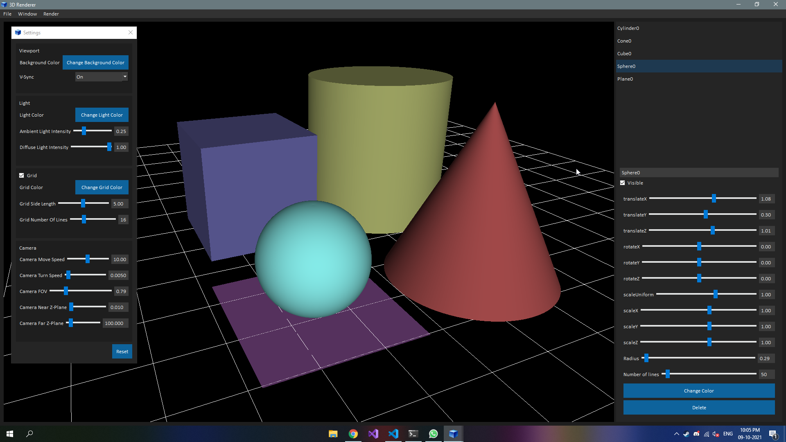

#  3D Renderer

## Introduction
This is my first attempt to make a basic 3D Renderer using OpenGL and Qt Framework in C++. As of now, you can add the primitives: plane, cube, cone, cylinder and sphere to the scene. You can modify translate, rotate, scale, color and object specific properties of individual objects. For example, Object specific properties of a cone include its radius and height. In future, I will add the ability to load models from file and serializability of scenes. The scene has only 1 camera through which we can traverse around the scene using WASD keys and mouse. We can change camera settings like FOV, movement speed and turning speed. As of now, there will be only 1 directional light in the scene in the direction of the camera. The light follows the Phong Model of Lighting although only ambient and diffuse components have been coded. We can modify the ambient intensity, diffuse intensity and light color. In future, I will code the specular lighting add the ability to add multiple lights and that too of different types. I have added flat shader and phong shader (being used by sphere).

## Changelog

- v0.2.0
    ### Added
    - Support for saving/loading scenes to/from files (new .scene extension). Opening .scene files with this application automatically loads it. Scene files will also contain info of version of the application used while saving.
    - Support for checking for updates.
    - settings.json now contains the version info which maybe usefull for supporting backwards compatibility in future.
    ### Fixed
    - Corrected step value of floating point sliders.

## Contributing
If you would like to contribute, you can contact me through any of the following:
- Email: bansalakshitwork@gmail.com
- LinkedIn: www.linkedin.com/in/abansal755
